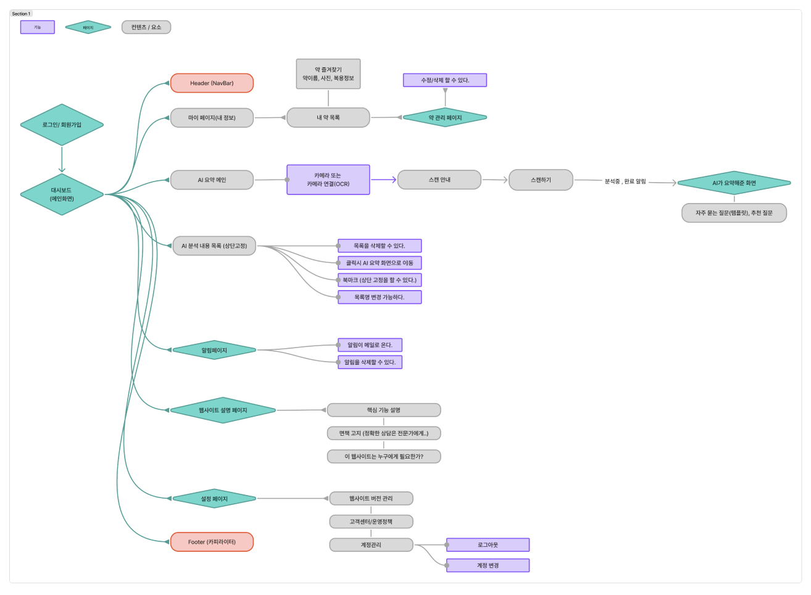
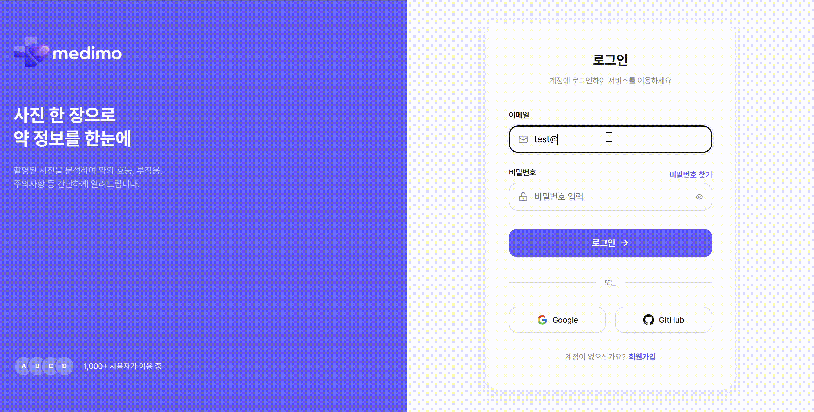
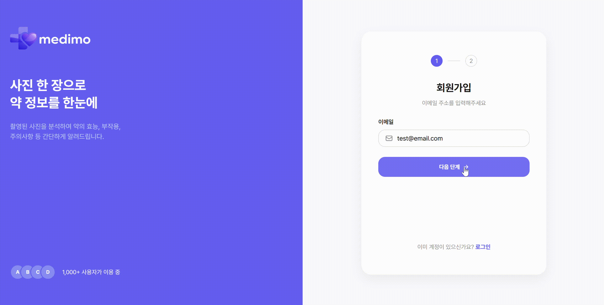
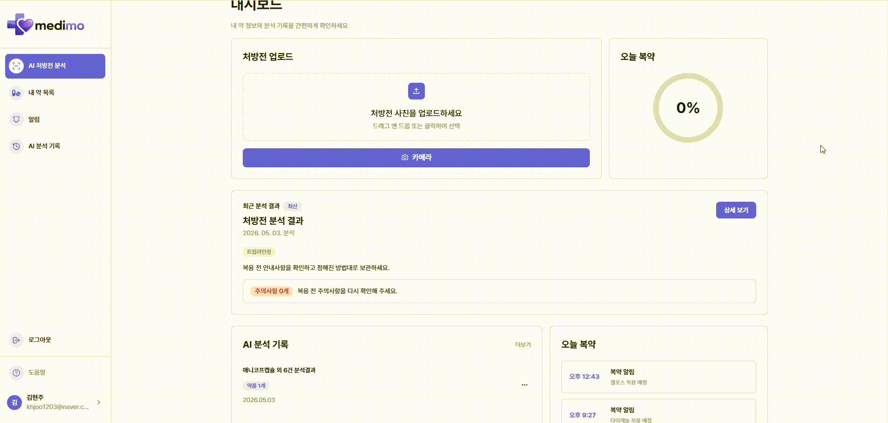
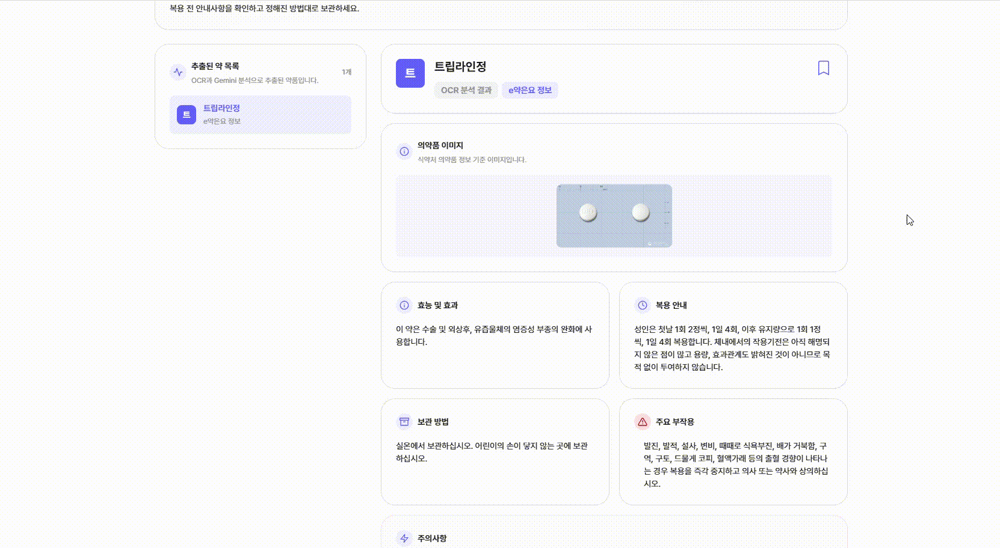
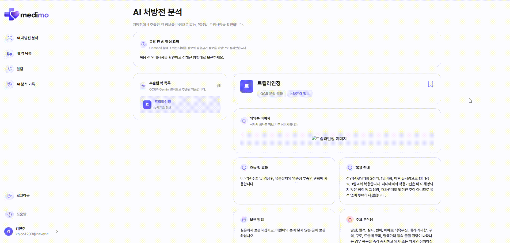
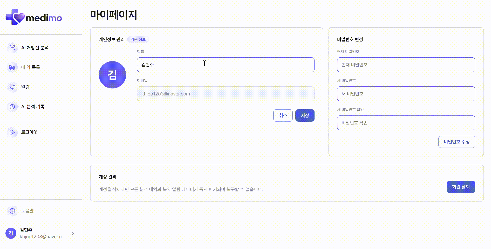

# Medimo(메디모) 

처방전 또는 약 이미지를 업로드하면 약 정보를 분석하고, 복용 주의사항과 보관 방법 등을 확인할 수 있는 의약품 정보 서비스입니다.

## 기획 배경
 병원이나 약국에서 받은 약을 시간이 지나 다시 확인하려고 할 때, 약 이름이나 복용 주의사항을 기억하기 어려운 경우가 많습니다.
  
특히 여러 약을 함께 복용하는 경우에는 어떤 약인지, 주의할 점이 무엇인지 쉽게 확인할 수 있는 서비스가 필요하다고 생각했습니다.


## 핵심기능

1. **처방전 스캔 & AI 분석**
약 봉투 또는 처방전을 촬영하면 Gemini AI가 약 이름, 복용법, 주의사항을 자동으로 정리
2. **복약 알림** 
복용 시간을 설정하면 웹 화면에서 제때 알림 확인 (앱 설치 불필요, PWA)
3. **복약 기록 & 북마크** 
과거 처방 내역과 자주 복용하는 약을 폴더별로 관리
4. **타겟 사용자**
    - 의학 용어에 익숙하지 않은 일반인
    - 여러 약을 동시에 복용 중인 환자
    - 가족의 복약을 함께 관리하고 싶은 보호자

🔗 [사이트 바로가기](https://medimo-ecru.vercel.app/)

- 워크플로우
<br/>



## 주요 기능

## 📅 개발 기간

> 2026.04.20 ~ 2026.05.03

## 👥 프로젝트 팀 소개

|                          프로필                           |  이름  |      역할      | 담당 페이지                                                                                                                                          |                  GitHub                  |
| :-------------------------------------------------------: | :----: | :------------: | :--------------------------------------------------------------------------------------------------------------------------------------------------- | :--------------------------------------: |
|     | 배유나 | 팀장, PM, 발표 | 버튼 클릭시 조건별 알림 메시지<br /> 에러/로딩 처리<br /> AI약 요약<br />gemini백엔드 만듦<br /> 웹사이트 설명페이지                                 | [GitHub](https://github.com/YUNA9627)  |
|     | 김현주 |    팀원, PL    | 식약처 API연결<br /> Google Vision API연결<br /> nodejs 서버 만듦<br /> 알림메시지 및 페이지<br /> 북마크 페이지<br />북마크 컴포넌트, 네비게이션 바 |   [GitHub](https://github.com/kkhhjjoo)    |
|       | 유지수 |      팀원      | 카메라 기능연<br /> 갤러리 연결<br />ai 채팅 내용 북마크 및 북마크 컴포넌트<br /> AI 분석 내용 목록                                                  |   [GitHub](https://github.com/yujsoo)    |
|  | 김민혁 |      팀원      | 로그인/회원가입<br /> OCR추출 정보 json파일 변환<br /> 주요질문 템플릿화 <br /> 설정                                                                 | [GitHub](https://github.com/leopard0315) |


## ⚙️ 기술 스택

| 분류 | 기술 |
| :--- | :--- |
| **프론트엔드** |    |
| **상태 관리** |  |
| **스타일링** |  |
| **API / AI** |   |
| **UI 컴포넌트** |  |
| **UI/UX 디자인** |  |
| **개발 환경** |  |
| **협업 툴** |    |
| **배포** |  |                                                                    
## 📚 라이브러리 선정 이유

| 기술 스택 | 도입 이유 |
| :--- | :--- |
| React | 컴포넌트 기반 아키텍처를 통한 UI 재사용성 및 개발 생산성 향상 |
| Zustand | 간결한 API와 보일러플레이트 최소화를 통한 효율적인 전역 상태 관리, localStorage persist 기능으로 새로고침 시 상태 유지 |
| CSS Modules | 스코프 격리를 통한 스타일 충돌 방지 및 컴포넌트 단위 스타일 관리 |
| OpenAI API | GPT-4o-mini 모델을 활용한 사용자 맞춤형 모임 카테고리 추천 |
| radix UI | 접근성을 고려한 UI 컴포넌트 (모달, 드롭다운 등) |

## 🖥️ 서비스 소개

### 🔐 로그인/회원가입

- 이메일 로그인
- 회원가입 시 각 항목별 유효성 검사
- 토큰 기반 인증 (accessToken, refreshToken)

| 데스크톱 |
| :---: |
|    |    |
|  |

---

### 🏠 대쉬보드 화면

- 메인 배너 및 서비스 안내

- AI 검색 모달


| 데스크톱 |
| :---: |
|    |

---

### 🏠 AI분석 화면

- AI로 분석한 약 정보 설명

| 데스크톱 |
| :---: |
|    |

---

### ⭐ 북마크

- 북마크 토글로 목록 추가/제거

| 데스크톱 |
| :---: |
|    |

---

### 👤 마이페이지


| 데스크톱 |
| :---: | 
|  |


## 🐛 트러블슈팅

| 이름     | 문제점                                                                                                                                                                                                                                                                                                                                                                                                                                                                                                     | 해결 방법                                                                                                                                                                                                                                                                                                                                                                                                                                                                                                                                                                            |
| -------- | ---------------------------------------------------------------------------------------------------------------------------------------------------------------------------------------------------------------------------------------------------------------------------------------------------------------------------------------------------------------------------------------------------------------------------------------------------------------------------------------------------------- | ------------------------------------------------------------------------------------------------------------------------------------------------------------------------------------------------------------------------------------------------------------------------------------------------------------------------------------------------------------------------------------------------------------------------------------------------------------------------------------------------------------------------------------------------------------------------------------ |
| **유나** | -                                                                                                                                                                                                                                                                                                                                                                                                                                                                                                          | -                                                                                                                                                                                                                                                                                                                                                                                                                                                                                                                                                                                    |
| **현주** | -                                                                                                                                                                                                                                                                                                                                                                                                                                                                                                          | -                                                                                                                                                                                                                                                                                                                                                                                                                                                                                                                                                                                    |
| **지수** | 북마크 클릭 시 여러 개가 동시에 선택되는 버그 발생. `git pull`을 받지 않아 최신 코드가 누락됨.                                                                                                                                                                                                                                                                                                                                                                                                             | `git pull`, `git merge`를 통해 최신 코드 동기화 후 해결                                                                                                                                                                                                                                                                                                                                                                                                                                                                                                                              |
| **민혁** | 1. **Git 브랜치 동기화 문제**: `develop` 브랜치에서 `git pull`이 정상적으로 되지 않는 문제 발생<br/>2. **CSS Module `:global` 사용 문제**: CSS Module에서 `:global`을 사용하면서 스타일이 전역으로 적용되어 다른 페이지에도 영향을 주는 문제 발생<br/>3. **로그인 상태 유지 문제**: 로그인 여부를 `useState`로만 판단해 로그인되지 않았을 경우 로그인 페이지로 강제 이동하도록 구현했는데, 새로고침 시 로그인 상태에서도 로그인 화면으로 이동하는 문제 발생. Hydration 이전 상태를 `false`로 인식했기 때문 | 1. **Git 동기화 해결**: rebase 사용 시 발생하는 히스토리 오염 문제를 팀원들에게 공유. 이후 `git pull`이 되지 않는 경우 `rebase` 대신 `merge` 전략을 사용하도록 협업 방식을 정리하여 develop 브랜치와의 버전을 안정적으로 맞춤<br/>2. **CSS 격리**: `:global` 사용을 최소화하고, 필요한 경우 더 구체적인 선택자를 사용하여 적용 범위를 제한. 컴포넌트 단위로 스타일이 격리되도록 구조 개선<br/>3. **Hydration 처리**: `useStore.ts`에 `setHasHydrated`를 추가하여 상태가 hydration된 이후에만 로그인 여부를 판단하도록 수정. 새로고침 시에도 로그인 상태가 정상적으로 유지되도록 개선 |

## 회고

<details>
  <summary>유나</summary>
  <ul>
    <li>좋았던 점:이번 프로젝트를 통해 단순히 화면을 만드는 것뿐만 아니라, 실제 서비스처럼 API 요청, 상태 관리, 인증, 배포 환경까지 연결하는 과정을 경험할 수 있었습니다. </li>
  </ul>
</details>
<details>
  <summary>지수</summary>
  <ul>
    <li></li>
    <li>좋았던 점: 이번 프로젝트를 진행하면서 단순히 UI를 구현하는 것에서 나아가, 상태의 흐름과 데이터 구조를 함께 고려하는 과정의 중요성을 느꼈습니다. 특히 API 연동 과정에서 데이터가 어떻게 전달되고 관리되는지 이해하게 되면서, 서비스 전체를 바라보는 시야가 넓어졌습니다.</li>
  </ul>
</details>
<details>
  <summary>현주</summary>
  <ul><li> 좋았던 점: React로 그룹프로젝트를 하면서 api를 이렇게 백엔드에도 적용하는구나 싶었습니다. </li>
  <li>아쉬웠던 점: 경험이 더 많아서 더 잘했으면 좋았을텐데 아쉬웠습니다</li>
  </ul>
</details>
<details>
  <summary>민혁</summary>
  <ul><li>좋았던 점: github를 이용해서 팀프로젝트 경험이 처음이라서 낯설었지만 팀원들이 도움을 주셔서 coding convention에 맞춰서 협업하는 경험을 쌓을 수 있었다. 프론트와 백을 연결하는과정이 문제가 있었지만, 영리하신 팀원의 도움으로 해결할 수 있었다. 다양한 시각을 가진 분들과 같이 협업을 함으로서 새로운 것에 대해 많이 배울 수 있는 좋은 경험이었다.</li>
  <li>아쉬웠던 점: 시간이 조금 더 있었더라면 추가기능들도 구현해볼 수 있었을텐데 그 점이 조금 아쉬운점이 남았다.</li>
  </ul>
</details>


- 회의록
# 2026년 4월

| 일 | 월 | 화 | 수 | 목 | 금 | 토 |
|---|---|---|---|---|---|---|
|   |   |   | 1 | 2 | 3 | 4 |
| 5 | 6 | 7 | 8 | 9 | 10 | 11 |
| 12 | 13 | 14 | 15 | 16 | 17 | 18 |
| 19 | 20 | 21 | 22 | 23 | 24 | 25 |
| 26 | [27](docs/dailyscrum/0427-데일리스크럼.md) | [28](docs/dailyscrum/0428-데일리스크럼.md) | [29](docs/dailyscrum/0429-데일리스크럼.md) | [30](docs/dailyscrum/0430-데일리스크럼.md) |   |   |

# 2026년 5월
| 일 | 월 | 화 | 수 | 목 | 금 | 토 |
|---|---|---|---|---|---|---|
|   |   |   |   |   | [1](docs/dailyscrum/0501-데일리스크럼.md) | [2](docs/dailyscrum/0502-데일리스크럼.md) |
| [3](docs/dailyscrum/0503-데일리스크럼.md) | 4 | 5 | 6 | 7 | 8 | 9 |
| 10 | 11 | 12 | 13 | 14 | 15 | 16 |
| 17 | 18 | 19 | 20 | 21 | 22 | 23 |
| 24 | 25 | 26 | 27 | 28 | 29 | 30 |
| 31 |   |   |   |   |   |   |

## 📁 프로젝트 폴더 구조

```bash
src
├─ components
│  ├─ AiAnalysisHistory
│  |  ├─ AiAnalysisHistoryItem.jsx
│  │  ├─  AiAnalysisHistoryItem.module.css
│  |  ├─ AiAnalysisHistoryList.jsx
│  │  ├─  AiAnalysisHistoryList.module.css
│  |  ├─ AiAnalysisHistorySection.jsx
│  │  ├─ AiAnalysisHistorySection.module.css
│  |  ├─ HistoryEmpty.jsx
│  |  ├─ HistoryItemActionMenu.jsx
│  │  └─ HistoryItemActionMenu.module.css
│  ├─ Badge
│  |  ├─ Badge.jsx
│  │  └─ Badge.module.css
│  ├─ Button
│  |  ├─ Button.jsx
│  │  └─ Button.module.css
│  ─ Card
│  |  ├─ Card.jsx
│  │  └─ Card.module.css
│  ├─ Checkbox
│  |  ├─ Checkbox.jsx
│  │  └─ Checkbox.module.css
│  ├─ Container
│  |  ├─ Container.jsx
│  │  └─ Container.module.css
│  ├─ Form
│  |  ├─ Form.jsx
│  │  └─ Form.module.css
│  ├─ Input
│  |  ├─ Input.jsx
│  │  └─ Input.module.css
│  ├─ Modal
│  |  ├─ Modal.jsx
│  │  └─ Modal.module.css
│  ├─ Pagination
│  |  ├─ Pagination.jsx
│  │  └─ Modal.module.css
│  ├─ Navbar
│  |  ├─ Navbar.jsx
│  │  └─ Navbar.module.css
│  ├─ PageHeader
│  |  ├─ PageHeader.jsx
│  │  └─ PageHeader.module.css
│  ├─ Radio
│  |  ├─ Radio.jsx
│  │  └─ Radio.module.css
│  ├─ Select
│  |  ├─ Select.jsx
│  │  └─ Select.module.css
│  ├─ Tabs
│  |  ├─ Tabs.jsx
│  │  └─ Tabs.module.css
│  ├─Textarea
│  |  ├─ Textarea.jsx
│  │  └─ Textarea.module.css
│  ├─ UploadCard
│  |  ├─ UploadActionBtn.jsx
│  │  ├─ UploadActionBtn.module.css
│  |  ├─ UploadCard.jsx
│  │  ├─ UploadCard.module.css
│  |  ├─ UploadDropBox.jsx
│  │  └─ UploadDropBox.module.css
|
│
├─ layout
│  ├─ AppLayout.jsx
│  └─ AppLayout.module.css
│
├─ lib
│   └─ bookmarkMappers.jsx

├─ pages
│  ├─ About
│  |  ├─ About.jsx
│  │  └─ About.module.css
│  ├─ AISummary
│  │  ├─ AISummary.jsx
│  │  ├─ AISummary.module.css
│  │  ├─ MoreQuestion.jsx
│  │  └─ MoreQuestion.module.css
│  ├─ Dashboard
│  │  ├─ Dashboard.jsx
│  │  └─ Dashboard.module.css
│  ├─ History
│  │  ├─ History.jsx
│  │  └─ History.module.css
│  ├─ Info
│  │  ├─ Dashboard.jsx
│  │  └─ Dashboard.module.css
│  ├─ Login
│  │  ├─ Login.jsx
│  │  ├─ Login.module.css
│  │  ├─ Signup1.jsx
│  │  ├─ Signup1.module.css
│  │  ├─ Signup2.jsx
│  │  └─ Signup2.module.css
│  ├─ Medicine
│  │  ├─ Medicine.jsx
│  │  └─ Medicine.module.css
│  ├─ Mypage
│  │  ├─ Mypage.jsx
│  │  └─ Mypageedicine.module.css
│  └─ Setting
│  │  ├─ Setting.jsx
│  │  └─ Setting.module.css
│
├─ styles
│  └─  global.css
├─ providers
│  ├─ ModalProvider.jsx
│  └─ useModal.js
├─ store
│  ├─ bookmarkStore.jsx
│  ├─ infoStore.js
│  ├─ ocrStore.jsx
│  └─ userStore.js
├─ App.jsx
├─ App.css
├─ index.css
├─ main.jsx
├─ sw.js
└─ main.jsx
```

---

<div align="center">

Made with ❤️ by Team Medimo

</div>